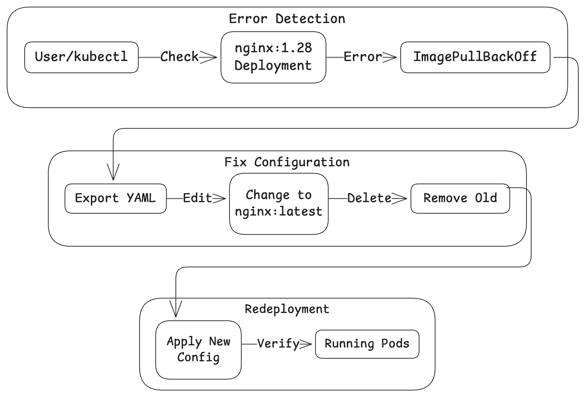

# 🚀 Kubernetes Deployment Management Pro

[](https://github.com/TheToriqul/k8s-edit-deployment)


## 📋 Project Overview

This project demonstrates advanced Kubernetes deployment management capabilities, focusing on real-world scenarios of deployment inspection, troubleshooting, and modification. Through this implementation, I've developed expertise in handling Kubernetes deployments, managing container images, and implementing robust debugging practices.

## 🎯 Key Objectives

- Master Kubernetes deployment management using both imperative and declarative approaches
- Implement professional-grade deployment inspection and troubleshooting workflows
- Develop expertise in managing container image configurations
- Establish best practices for Kubernetes resource management
- Create reproducible deployment modification procedures

## 🏗️ Project Architecture
When a deployment is edited via kubectl, the Kubernetes Deployment Controller orchestrates the update process by creating a new ReplicaSet for the updated configuration while gradually scaling down the old ReplicaSet. This controlled transition ensures zero-downtime updates as new pods with the updated specifications are created and old pods are systematically terminated, maintaining the desired application state throughout the process.

<figure >
  <p align="center">
      
      <p align="center">Project Architecture</p> 
  </p>
</figure>

## 💻 Technical Stack

- **Container Orchestration**: Kubernetes
- **Container Runtime**: Docker
- **Web Server**: Nginx
- **Tools**: kubectl, YAML

## 🚀 Getting Started

<details>
<summary>🐳 Prerequisites</summary>

- Kubernetes cluster (local or cloud-based)
- kubectl CLI tool installed and configured
- Basic understanding of YAML
- Docker installed (for local development)

</details>

<details>
<summary>⚙️ Installation</summary>

1. Clone the repository:
   ```bash
   git clone https://github.com/TheToriqul/k8s-edit-deployment.git
   ```
2. Navigate to the project directory:
   ```bash
   cd k8s-edit-deployment
   ```

</details>

<details>
<summary>🎮 Usage</summary>

1. Create the initial deployment:
   ```bash
   kubectl create deployment my-nginx --image=nginx:latest --replicas=3
   ```

2. Verify deployment status:
   ```bash
   kubectl get deployments
   kubectl get pods
   ```

For detailed commands and explanations, refer to the [reference-commands.md](reference-commands.md) file.

</details>

## 💡 Key Learnings

### Technical Mastery:

1. Advanced Kubernetes deployment management strategies
2. Container image version control and troubleshooting
3. Kubernetes resource inspection and debugging techniques
4. YAML-based configuration management
5. Deployment scaling and update strategies

### Professional Development:

1. Infrastructure problem-solving methodologies
2. System debugging and troubleshooting
3. Documentation and process standardization
4. Technical decision-making
5. DevOps best practices implementation

## 🔄 Future Enhancements

<details>
<summary>View Planned Improvements</summary>

1. Implement rolling update strategies
2. Add health check configurations
3. Integrate with CI/CD pipelines
4. Implement resource limits and requests
5. Add monitoring and logging solutions
6. Create automated testing procedures

</details>

## 🙌 Contribution

Contributions are welcome! Feel free to [open an issue](https://github.com/TheToriqul/k8s-edit-deployment/issues) or submit a [pull request](https://github.com/TheToriqul/k8s-edit-deployment/pulls) to suggest improvements or add features.

## 📧 Connect with Me

- 📧 Email: toriqul.int@gmail.com
- 📱 Phone: +65 8936 7705, +8801765 939006
- 🌐 LinkedIn: [@TheToriqul](https://www.linkedin.com/in/thetoriqul/)
- 🐙 GitHub: [@TheToriqul](https://github.com/TheToriqul)
- 🌍 Portfolio: [TheToriqul.com](https://thetoriqul.com)

## 👏 Acknowledgments

- [Poridhi for providing comprehensive labs and inspiring this project](https://devops.poridhi.io/)
- The Kubernetes community for excellent documentation
- Fellow developers who provided valuable feedback

---

Thank you for exploring this repository showcasing my Kubernetes deployment management expertise. I hope you find the implementations and documentation valuable for your own projects. Happy deploying! 🚀